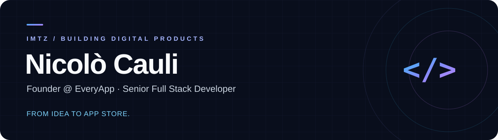

  

  
  
  
  

  <b>Mobile experiences. Solid backends. Products people use.</b> 
  Based in Sardinia, Italy · Building with EveryApp

---

### The developer behind the handle

I'm **Nicolò**, also known as **IMTZ** — Founder & CEO of [EveryApp](https://www.everyapp.shop/) and Senior Full Stack Developer.

I build digital products from the first sketch to release: interfaces, backend services and mobile apps. At EveryApp, I lead the team bringing those pieces together.

- **Mobile first:** React Native, Ionic and Swift.
- **Across the stack:** web interfaces, Node.js backends and application integrations.
- **Through to launch:** UI/UX, development and App Store / Play Store publishing.

### Selected work

Four apps from my portfolio — built to be used.

| Product | What it does | Explore |
| :--- | :--- | :--- |
| **EveryMusic** | My own music app: smart search, playlists, background playback and in-app subscriptions. | [App Store ↗](https://apps.apple.com/it/app/everymusic/id6759969055) |
| **ServeNow** | An app for Serve the City, connecting volunteers with local projects and communities. | [App Store ↗](https://apps.apple.com/it/app/servenow-volunteering/id1535019384) |
| **Radio Visionair** | Live radio, program schedules and background audio in a dedicated mobile experience. | [App Store ↗](https://apps.apple.com/it/app/radio-visionair/id6748015567) |
| **Museo di Teti** | A mobile app for the Museo di Teti, bringing local cultural heritage to visitors. | [App Store ↗](https://apps.apple.com/it/app/museo-di-teti/id6744748356) |

[See the projects in detail →](https://imtzson.github.io/#projects)

### My toolkit

  
  
  
  
  

| Area | Technologies |
| :--- | :--- |
| **Frontend** | React · Angular · JavaScript · TypeScript · HTML · CSS · Ant Design · Less |
| **Mobile** | React Native · Ionic · Swift |
| **Backend & data** | Node.js · Egg.js · MongoDB · PHP · Python |
| **Workflow** | Git · GitHub Actions · Docker · VS Code · PyCharm |

---

  <b>Have an idea worth building?</b> 
  Let's turn it into a product.  
  <a href="mailto:cauli.nicolo2003@gmail.com">Get in touch</a>
  &nbsp;·&nbsp;
  <a href="https://www.everyapp.shop/">Work with EveryApp</a>
  &nbsp;·&nbsp;
  <a href="https://imtzson.github.io/">Explore my portfolio</a>

